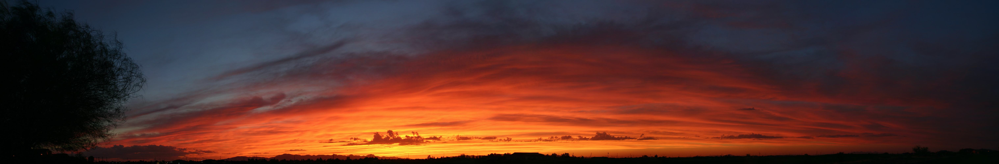

*(This was a digitially stitched composite of roughly 20 photos.  Circa 2004, this was back before taking panoramas was a simple thing to do.  Arizona sunsets are the best.)*

> *Note*:  If you're reading this via straight Github, it is also now available in an easier to read format at [jotpowers.github.io](https://jotpowers.github.io/).  You can thank Vidit for opening [this issue](https://github.com/jotpowers/College-Grads/issues/1). If you're reading this via Github Pages, then the bare repo is available [here](https://github.com/jotpowers/Hobbies).

This is the repo for documenting the various things I have created because I find them interesting.  Most of them tend to be "Design & Fabricate" but there is some variety.  Some have required code,some of them are only code, and most have no code.

I make no commitments to the elegance of the code or the quality of the comments.  Mostly, these were all for me to have a little fun.

* [Lock and Key](lock-n-key/lock-n-key):  A novel system of creating a "key" out of resin that can be used to create secure locks.  Patent pending, not because it is likely to get manufactured, but because the company I work for believes it has some interesting intellectual property aspects.
* [Intubation box](Intubation-Box): How to build an intubation box as Personal Protective Equipment (PPE) for doctors 
* [Tshirt sorter](tshirts/tshirts.md):  How to sort my tshirts.  Really.
* [Shipping box](shipping-box.md):  A parametric folding cardboard box.

## License

This work is licensed under a
[Creative Commons Attribution-ShareAlike 4.0 International License](https://creativecommons.org/licenses/by-nc-sa/4.0/)

