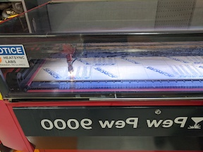
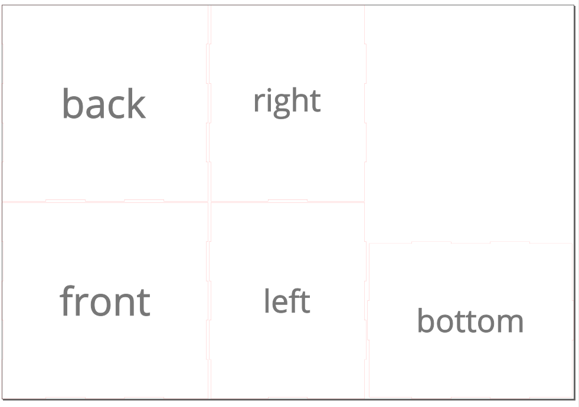
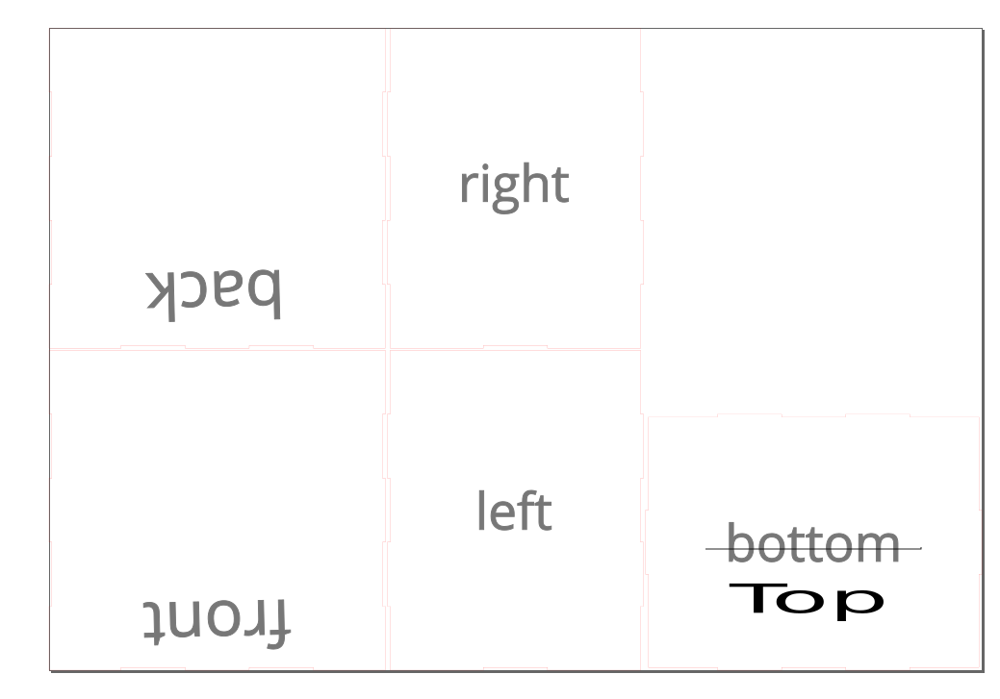
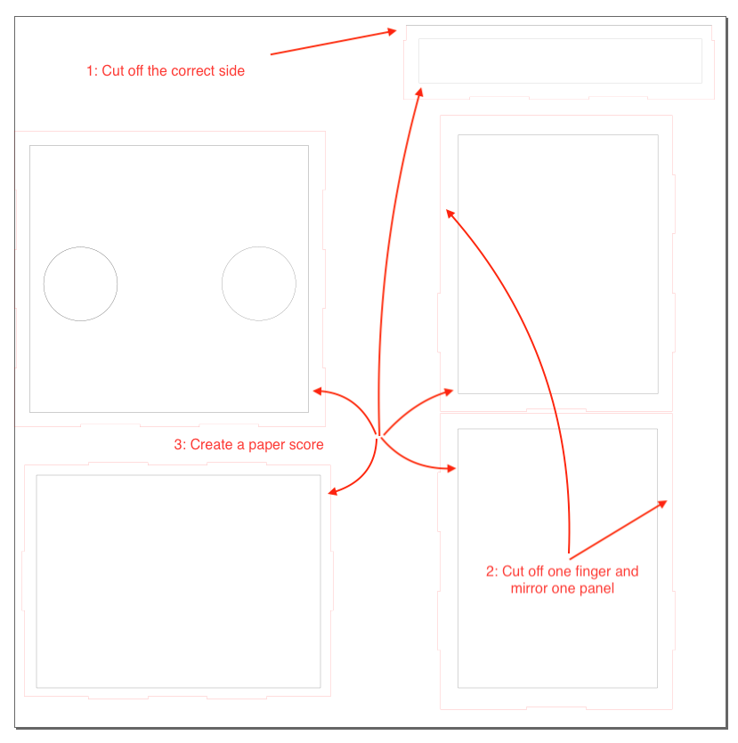
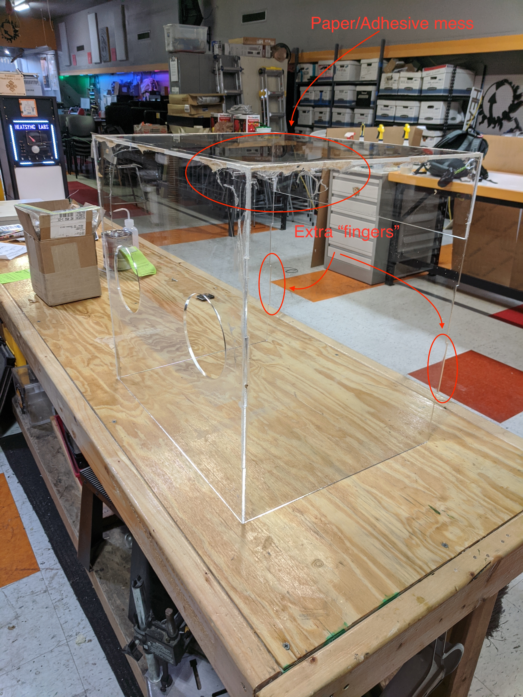
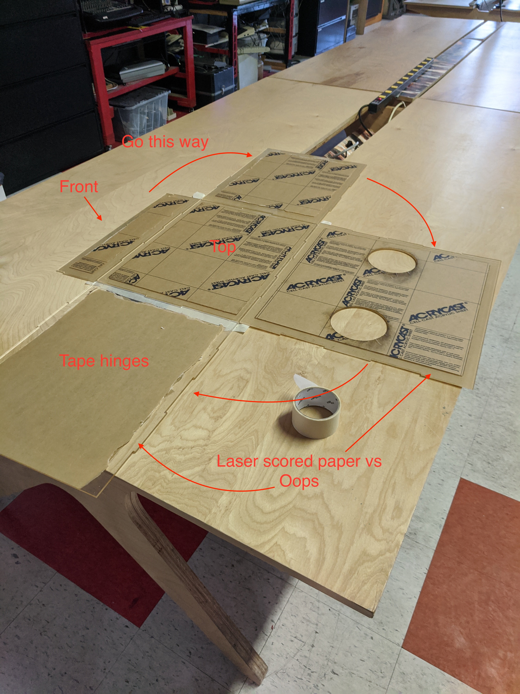
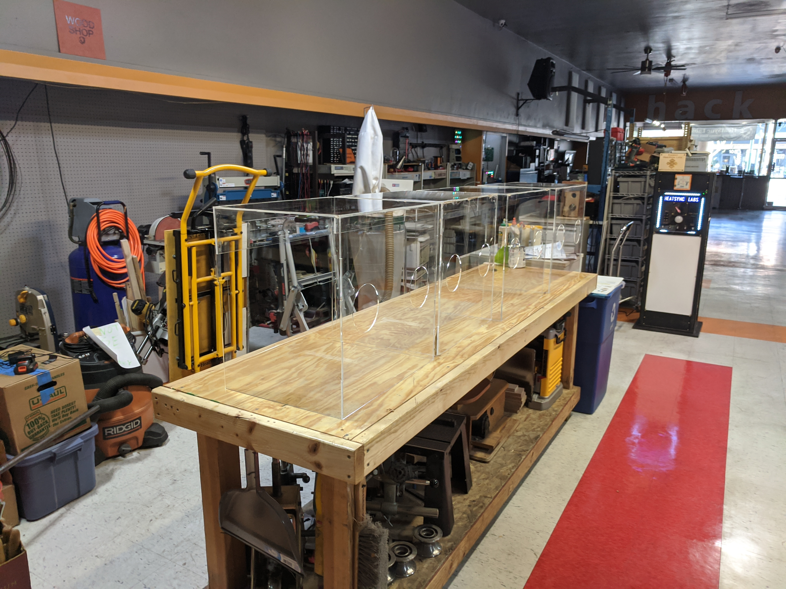

# Introduction

I've done some 3D printing (probably largely because my son started doing it), so when the large [equipment shortages](https://en.wikipedia.org/wiki/Shortages_related_to_the_2019%E2%80%9320_coronavirus_pandemic) happened during COVID-19 I ended up getting involved.  I'd been spending some time at our local [makerspace](https://en.wikipedia.org/wiki/Hackerspace), [HeatSync](https://www.heatsynclabs.org/), and several of them quickly became involved with [MasksForDocs](https://masksfordocs.com/).  While all that spun up, we also had a local request come up on the HeatSync slack.

Oh, and as a side notes [lasers are cool](assets/VID_20200402_072807.mp4).

# Intubation boxes

Someone local had a friend that was an emergency room doctor who was asking about making intubation boxes.  They said they had a real need for these, and provided the website for the design: [IntubationBox.com](https://intubationbox.com/).  This documents how we built and delivered 4 of these to the ER doctor.

Now, HeatSync has a laser I've been doing some work with, so I recognized we could probably cut these pretty easily.  After a quick internal discussion, myself and one other person (shout out to Kyle) agreed to try.  Kyle ordered the acrylic adhesive and I contact [Port Plastics](http://www.portplastics.com).  It took us a few days to get the material, but then we were ready to go.

# Materials needed

*  1 4'x4' (1220mmx2440mm) sheet of 4.5mm acrylic (see below for more details)
*  [Weld-On 4](https://smile.amazon.com/Weldon-Applicator-Bottle-Pint-10308/dp/B00TCUJ7A8/ref=sr_1_1?dchild=1&keywords=weld-on+4&qid=1586010116&sr=8-1) acrylic adhesive with applicators
  * Ok, this is what we used.  I'm not sure it's the best for this application.  It's extremely liquid (same viscosity as water) so you're definitely going to want to use something like [these applicators](https://smile.amazon.com/Applicator-Bottle-Stainless-Steel-Needle/dp/B00BNI6TOE/ref=sr_1_7?dchild=1&keywords=weld-on+4+applicator&qid=1586010218&sr=8-7).
  * You might be better off with something more viscous.  I'd probably try [Weld-On 16](https://smile.amazon.com/SCIGRIP-Acrylic-Cement-Low-VOC-Medium/dp/B005ZH31W2/ref=sr_1_1?crid=25V8A1S5D4NVI&dchild=1&keywords=weld-on+16+acrylic+cement&qid=1586010085&sprefix=weld-on+16+a%2Caps%2C239&sr=8-1).
*  2" wide masking tape
*  Paper towels
*  Laser 

Total cost:  ~$55 per box.  It's just over $50 for the acrylic and then another $5 is misc supplies.  Plus, obviously, you already need access to a laser.  

# Design

The design of the current box is interesting.  First, it's a strange mish-mash of metric and imperial measurements.  But more importantly for this discussion, the design relies on straight cut sides and then a dado in the top to accept them where you can glue.

In all honesty, I just didn't figure we had the techical skills to pull that off.  The idea of getting it square, figuring out how to cut a dado in acrylic of the right dimensions, all seemed like it was outside of what we were capable of executing.  But, what I did think we could execute was one that used [finger joints](https://en.wikipedia.org/wiki/Finger_joint).  So, to create that all I need is a box of the correct dimensions that I can edit, and now we can create the cut files, cut it and glue it.

The goal of the rest of this documentation isn't actually to document the details of how I did it, but to provide you with some of our learnings so that if you need to make your own you can skip through a few of the problems we have worked through.

# Generating the box

This is simple enough.  [Google "laser cut box generator"](https://www.google.com/search?&q=laser+cut+box+generator) and take the top hit.  For me that was [MakerCase](https://en.makercase.com/#/).  Here is what you need to know:

* Open box (it will show without a top, but that will be your bottom)
* Dimensions:  I just put in the ones from the documentation (or at least close)
  * Width: 21" 
  * Height: 19.5"
  * Depth: 15.75" (which is exactly 400mm, notice the random sizes)
* Material Thickness:  The document calls for 3/16" which is .1875", but my acrylic place had .177" (i.e. 4.5mm).  So, that's what I put in.

Download the SVG.  I've provided the one I generated [here](assets/box.svg).

# Design the new Intubator box

I'm not going to go into all the details of how you would create this box.  I used Inkscape to edit the SVG.  The good news with Inkscape is that it's free.  The bad news is that it's more than a little bit clunky.  To do this, all you really have to do is draw two circles of the right size on one side, and then chop the other side down a bit.  Simple enough, right?

## Relabel the diagram
The first thing that I think that helps is to relabel everything to keep it straight in your mind.  Remember, we printed a box with an open top, and now we want one with an open bottom and two sides that are different. I think of the "front" as the part that is open and the "back" as the part with the holes that the doctor will stand behind.  I actually changed those labels as I worked so I wouldn't get confused.

Here I've changed Bottom to Top, and then flipped and moved front and back to represent what sides I think of them as.  *Foreshadowing*: I've actually corrected a mistake I made when I did this, but we'll go into that in a minute. 

  
* [SVG](assets/box-markedup.svg)

## Modify the SVG

Now is time to modify the SVG.  You need to add the arm holes and cut off one side of the front to make it the right size.  Again, I'm not going to go into the details of how to do that, but here are the resulting end files.

* [SVG](assets/20200402-06-jot-box.svg)
* [DXF](assets/20200402-06-jot-box)

## Lessons

1. Cut off the correct side of the front.  In my first version I had both front and back up towards the middle of the diagram.  The result was I cut off the fingered portion of the front, and endedup with two smooth sides.  Oops.  Don't do that.  You want to make sure you have a fingered side and a flat side.
2. On the sides I forgot to remove one of the fingers.  It's visible in a picture I'm sure I'll add later, but because the front is partial you don't need one of the fingers.
3. Create a paper "score" mark on all of these pieces.  In order to glue these all together you need to remove about an 3cm of paper from the edge so that it's not soaking up the adhesive.  Now, you can do that by hand, but you have a laser right there, so just try to figure out a setting that cuts the paper but does not score the acrylic.  Good luck with that.  
4. Ok, it's not its own number on the diagram, but make sure when you do the laser score on the sides, you "mirror" one of the pieces.  In other words, the score needs to be on the inside of both of the sides.  If you make them the same, you'll end up with the score on the wrong side of the sheet when you assemble.

# Assembly

Here is what has worked for us.  Could be revised.  Also, it's late and I'm tired, so I might get something wrong.

## Steps

Ok, so now you have it all cut out, and the paper removed from one side. 

*Note*: Ok, you _might_ be able to do this with one person, I'd recommend at least two.

1. Lay out all the pieces for the box, layed flat.
2. Apply a border of the masking tape to the "outside" (or the side you didn't have scored) of the "top".
3. Place that top with the paper down and the tape up.
4. Now take the sided pieces and fit them, one at a time, onto the top as if they were assembled and press them into the tape.  Then lay them down so you now have a 'tape hinge'.
5. Repeat for all sides.
6. Apply weld-on to the "front" piece and the top first and get it into place.  Hold for 60 seconds.
7. Work your way around from least convenient (hardest) to easiest.  Reason you do this is because it will become more complex as you go, so doing the hard parts first makes it go smoother.

## Things to do between steps
1. Wipe out the excess from the corners.
2. Write the great American novel.
3. Hold the corners and edges in tight for 60 seconds.

Finally...

1.  Start the paper being peeled for the health care workers to unveil them.

Here is the picture of our four prototypes complete.

# What I would do next time

*  Build a jig for the bottom.  That would allow it to be really snug and repeatable and perhaps could be assembled by one person.  I'd probably get a thin piece of plywood and laser cut a square to the exact size and then dry fit everything in there.
*  Build some sort of jigs for the sides.  This would probably be a square plywood "ring" to hold it in.
*  Use the needle applicators on the Weld-on
*  Probably scrap the scoring of the paper and just remove all the paper before the assembly and gluing.  Sure, they might get scratched in transit, but they're going to get scratched when they're used anyways.

# Additional links

* [New England Journal of Medicine: Barrier Enclosure during Endotracheal Intubation](https://www.nejm.org/doi/full/10.1056/NEJMc2007589)
