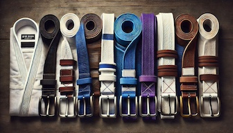

I'm finally getting around to start documenting some of my "learnings" from jiu-jitsu.  Let's be clear, I'm not very good.  I'm an older, lightweight(ish), lower belt, so if you disagree with something I put here, you're probably right.  

That being said, I tend to be pretty analytical, and people say my game is "technical" (which I think is their nice way of saying "wow, you're not very athletic").  So, I figured I'd start documenting the things that I think are really helpful for people starting out, because it's so easy to forget how hard it was.

:::note 
When I say something is "always" true, you should recognize that [60% of the time it's true 100% of the time](https://www.youtube.com/watch?v=IKiSPUc2Jck&t=80s).  Which is to say, it's mostly true and true enough when you're starting out that you can take it as an absolute.  When you begin to learn better, you'll know enough that you're no longer reading this and you can laugh at the naivete.  
:::

# Starting Out

When you start out it is overwhelming.  You feel like you're fighting for your life and you learn about some technique, and when you go to implement it, you can't remember any of the pieces and the pieces you can remember don't even work.  Small children are climbing all over you like you're some sort of incompetent jungle-gym and you're flopping around like a like a wounded mackrel.  Don't worry, that's normal.

It was six months before I was doing a move and I felt what my opponent was doing and knew what a counter was and could implement it.  It was feeling them trying to bridge from mount and knowing I could gravevine the opposite leg.  Super simple.  Took six months!

After a year, you probably know the various positions and know how to get submitted from all of them.  This is also normal.  Sure, you have one or two places you feel more comfortable, but it's still a mess.

After two years I felt like I could start to recognize the importance of understanding details.  Could I execute on them?  Heck no.  Could I recognize them in the moment?  Of course not.  But I could recognize them as being important.

After three years I felt like <insert something here when I get to the three year mark>  :P  

# How to Speed Up Your Progress

## If the "Room" Gets Better, You'll Get Better

So you need to be a great training partner.  This is really difficult to do when you're starting out because you feel like the only way you ever "win" is if you go really hard.  If that is all you do though, you have an increased likelyhood to get injured, injure your training partners, and fail to understand why techniques work.  Every injury results in a loss of ability to train.  If you're not training, you're not going to get better.  So, prioritize avoiding injuries for everyone.  Are they going to happen?  Yes.  But I will tell you that almost without exception, my injuries have all been caused by me.  

This directly leads me to...

## Tapping is not Losing

I distinctly remember the moment that I internalized this.  I was rolling with one of my regular training partners who is better, younger, faster, and more athletic than I am.  He'd shot up a pretty good triangle that I defended and slowly managed to work my way out of.  But, at the end of that, I ended up underneath him in some sort of weird position where neither of us had anything and it was going to be an odd scramble.  So, I tapped.  I just wanted to reset so that we could go back to practicing jiu-jitsu instead of just spazzing out in our pyjamas.

Instead, think of tapping as saying:  "I don't feel like I'm going to learn what I need to where we are, and I want to reset."  Sure, sometimes that includes me being in a fully locked-in bow and arrow.  But other times it's just "I wanted to work on closed guard escapes and now we're in spider guard so I'm not learning what I want from this position."  

## Use Your Words

I can not emphasize enough how stupid I felt when I realized this was a secret shortcut.  Seriously, if you want to get better, generally you just need to tell people what you're trying to accomplish and they're almost always willing to do it!

Let me give you some concrete examples:

* You're at an open mat, and instead of just doing "live rolls" the whole time you say:

> I'm trying to work on my half-guard passing.  Would you mind if we just setup that and worked on it?

* You're a smaller person and the only person to pair up with is huge.

> We can roll, but I don't want to end up underneath you.

* You're injured but still want to roll

> My back is a hot mess, so we have to go super easy.  Does that work for you?

* You're doing specific training, but you have a question on a certain position that the person you're working with is good at.

> Hey Charlie, I'm having a problem finishing the north south choke.  Can you show me what I'm getting wrong?

## practice specific stuff
change the win conditions if it gets you more reps

take notes

set different win conditions (i.e. no arm bars for a week)

ask people who are good at different things for help ... there is specialization

start with one thing from every position... then move to two.

Stuff to add
link to Christian video on elbow knee
link to redding post on skin care and the bjj MM podcast that was the source
find the running man video

friends close and elbows closer
inside lane
henry akins relax
submeta intro class

half-guard is best guard

# Resources

## Podcasts

* [BJJ Mental Models](https://www.bjjmentalmodels.com/podcast)
* [I Suck At Jiu Jitsu](https://open.spotify.com/show/3xEFgc72GKW5ftojiMYpSOv)
* I'm also morally obligated to suggest [The Jiu-Jitsu Mindset](https://open.spotify.com/show/0TsZ2w9qk5X96rVgwRXfEm)

## License

This work is licensed under a
[Creative Commons Attribution-ShareAlike 4.0 International License](https://creativecommons.org/licenses/by-nc-sa/4.0/)

