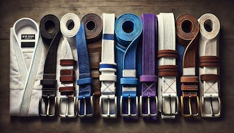

I'm finally getting around to start documenting some of my "learnings" from jiu-jitsu.  Let's be clear, I'm not very good.  I'm an older, lightweight(ish), lower belt. So if you disagree with something I put here, you're probably right.  

That being said, I tend to be pretty analytical, and people say my game is "technical" (which I think is their nice way of saying "wow, you're not very athletic").  So, I figured I'd start documenting the things that I think are really helpful for people starting out, because it's so easy to forget how hard it was.

:::note 
When I say something is "always" true, you should recognize that [60% of the time it's true 100% of the time](https://www.youtube.com/watch?v=IKiSPUc2Jck&t=80s).  Which is to say it's mostly true, and true enough when you're starting out that you can take it as an absolute.  When you begin to learn better, you'll know enough that you're no longer reading this and you can laugh at the naivete.  
:::

# Starting Out

When you start out it is overwhelming.  You feel like you're fighting for your life and you learn about some technique, and when you go to implement it, you can't remember any of the pieces and the pieces you can remember don't even work.  Small children are climbing all over you like you're some sort of incompetent jungle-gym and you're flopping around like a like a wounded mackrel.  Don't worry, that's normal.

It was six months before I was doing a move and I felt what my opponent was doing and knew what a counter was and could implement it.  It was feeling them trying to bridge from mount and knowing I could gravevine the opposite leg.  Super simple.  Took six months!

After a year, you probably know the various positions and know how to get submitted from all of them.  This is also normal.  Sure, you have one or two places you feel more comfortable, but it's still a mess.

After two years I felt like I could start to recognize the importance of understanding details.  Could I execute on them?  Heck no.  Could I recognize them in the moment?  Of course not.  But I could recognize them as being important.

After three years I felt like "insert something here when I get to three years".

# How to Speed Up Your Progress

## If the "Room" Gets Better, You'll Get Better

So you need to be a great training partner.  This is really difficult to do when you're starting out because you feel like the only way you ever "win" is if you go really hard.  If that is all you do though, you have an increased likelyhood to get injured, injure your training partners, and fail to understand why techniques work.  Every injury results in a loss of ability to train.  If you're not training, you're not going to get better.  

Prioritize avoiding injuries for everyone.  Are they going to happen?  Yes.  But I will tell you, that almost without exception, my injuries have all been caused by me.  

This directly leads me to...

## Tapping is not Losing

I distinctly remember the moment that I internalized this.  I was rolling with one of my regular training partners who is better, younger, faster, and more athletic than I am.  He'd shot up a pretty good triangle that I defended and slowly managed to work my way out of.  But, at the end of that, I ended up underneath him in some sort of weird position where neither of us had anything and it was going to be an odd scramble.  So, I tapped.  I just wanted to reset so that we could go back to practicing jiu-jitsu instead of just spazzing out in our pyjamas.

Instead, think of tapping as saying:  "I don't feel like I'm going to learn what I need to where we are, and I want to reset."  Sure, sometimes that includes me being in a fully locked-in bow and arrow.  But other times it's just "I wanted to work on closed guard escapes and now we're in spider guard so I'm not learning what I want from this position."  

## Use Your Words

I can not emphasize enough how stupid I felt when I realized this was a secret shortcut.  Seriously, if you want to get better, generally you just need to ask people to help you with what you're trying to accomplish and they're almost always willing to do it!

Let me give you some concrete examples:

* You're at an open mat, and instead of just doing "live rolls" the whole time you say:
  * _I'm trying to work on my half-guard passing.  Would you mind if we just setup that and worked on it?_

* You're a smaller person and the only person to pair up with is huge.
  * _We can roll, but I don't want to end up underneath you._

* You're injured but still want to roll
  * _My back is a hot mess, so we have to go super easy.  Does that work for you?_

* Specific training win conditions are all the way to submission but you want to work on the position
  * _Let's just work on this position.  If we're not making progress do you mind if we just reset?_

## Take Notes

Do you leave the gym and and can't remember the three techniques you practiced, much less the details?  Starting writing them down right after practice.  Go buy a small notebook and right after practice, just write everything down.  It forces you to think through each of the techniques and try to remember the details. It doesn't even matter if you go back and re-read them, the simple process of [writing it down will likely help you progress faster](https://www.npr.org/sections/health-shots/2024/05/11/1250529661/handwriting-cursive-typing-schools-learning-brain).

## Create Secret Win Conditions

You're going to spend a long time being bad.  If you're small, it's even worse, because you're going to spend a long time being bad **AND** getting smashed.  So create some secret goals that are your win conditions.  As an example, there was a period of time where I felt I was giving up arm bars all the time.  So, I just started a week with the goal of "I will not give up any arm bars this week."  I think I ended up giving up two that week.  I got submitted all sorts of other ways, but not armbars.  That made that week a success for me, and everyone needs some wins.

## Solve Problems Instead of Collecting Techniques

Now is the time, like [all older people](https://www.youtube.com/watch?v=tJ-LivK4-78), for me to rail against the evils of social media.  Every time I see some technique on TikFaceGramSter I think the same thing:

"Oh, that will totally work!  I need to make sure I hit that next time I roll."

Then it gets replaced with the next one, and the next one, and the ...   or, it just doesn't work.

Instead I think you should focus on problems you're having and what techniques could potentially help you there.

As an example, from open guard I've recently been really struggling against people who can get to headquarters or start a knee cut pass.  I find that I end up trying to defend that with Reverse De La Riva (RLDR), but I don't really know how to make that effective.  So, I've spent time working on RLDR because it now is easier to learn because it's the the context of something I'm trying to fix.

Another example is how a lot of us end up working on [Lockdown](https://www.youtube.com/watch?v=3f2Qkpb98WI) as a way to respond to getting smashed in half guard. 

You'll get better trying to solve problems than you will just collecting techniques.

## Get More Reps by Practicing Small Pieces

Going back to the "Use Your Words" section, if you want to get better at something you should set win conditions that get you the most reps possible.  The best way to do this is to ask a partner to work on something, and set a "win condition" that allows for as may reps as possible.  

The first place I feel like I really worked on this was side control.  I hated side control specific training the most.  On the bottom I felt like I could never escape.  On the top, I felt like I couldn't ever hold anyone down.  That specific training was always an exercise in frustration.  So, after class I would just ask people to work on side control with me.  I'd take side control bottom and try to work out of it.  I didn't need to go from bottom to being in mount, I just had to get to a place where it was going to be a scramble or we were starting to muscle/spazz.  Then I would stop and reset back to the start.  Over the course of a few weeks I feel like I made way more progress than I had in the months of frustration before then.

:::tip
This will generally go better and be more well received if you're starting in the inferior position. So, asking someone to help you with _bottom_ side control is easier than asking them to work with you in _top_ side control.  After you earn a reputation of really wanting to learn, people will be more willing to let you work on the superior position.
:::

## Specific Tactical Techniques

"This is all well and good, but I really need to know the techniques that will help me get better!"  -White Belt You

The fact is that there are no magic techniques.  *But*, there are some general things that you can do that will help you survive a little longer until you get the mat hours in you need.

* "Keep your friends close and your elbows closer."  -[Priit Mihkelson](https://www.defensivebjj.com/)
* From [Christian Graugart's](https://www.bjjheroes.com/bjj-fighters/christian-graugart) [White Belt Survival Course](https://www.youtube.com/watch?v=vOznf6T9B8I):
  * To defend you need to protect your knee to chest space.  When you attack you want to get into their knee chest space.
  * Keep your hair higher than your butt
  * When attacking always try to get their arms up/elbows out.  Always think abou their armpits.
* On offense try to eliminate space, on defense try to make space.
* Just try to keep your elbow and your knee connected.  If they can't get into the space between those two, they can't pass.

# Hygiene

A little known secret of jiu-jitsu:  50% of the time is spent working on technique, and the other 50% of the time is spent on laundry.

* Start every session with clean clothes.  This means that everything has to be washed after you use it once and before you use it again.
* Shower as soon as is reasonable after every session.
* Advice from dermatologist [Dr. Clayton Green](https://podcast.bjjmentalmodels.com/243161/episodes/11222643-ep-198-skincare-for-bjj-feat-dr-clayton-green):
  * Wash with a gentle soap.  Bar soap is generally better than liquid.  Dove is a good brand
  * After you shower apply a lotion that you have to scoop. My personal preference is [CeraVe](https://www.cerave.com/skincare/moisturizers/moisturizing-cream)

# Videos

* [Lachlan Giles](https://www.bjjheroes.com/bjj-fighters/lachlan-giles) has his excellent platform, [Submeta](https://submeta.io).  The [Introductory course](https://submeta.io/@lachlangiles/courses/introduction) is 4.5 hours long.  You do have to signup for the platform, but the course is free so it doesn't cost you anything. 
* You spend so much time just trying to defend, why wouldn't you want to watch [Chris Paines'](https://www.youtube.com/c/ChrisPainesBJJ) [How to Defend Everything](https://www.youtube.com/watch?v=BWitv9AKoNU)?

# Resources

## Podcasts

* [BJJ Mental Models](https://www.bjjmentalmodels.com/podcast)
* [I Suck At Jiu Jitsu](https://open.spotify.com/show/3xEFgc72GKW5ftojiMYpSOv)
* I'm also morally obligated to suggest [The Jiu-Jitsu Mindset](https://open.spotify.com/show/0TsZ2w9qk5X96rVgwRXfEm)

## To Be Added

* start with one thing from every position... then move to two.
* find the running man video
* inside lane
* henry akins relax
* half-guard is best guard
* You're doing specific training, but you have a question on a certain position that the person you're working with is good at.

## License

This work is licensed under a
[Creative Commons Attribution-ShareAlike 4.0 International License](https://creativecommons.org/licenses/by-nc-sa/4.0/)

