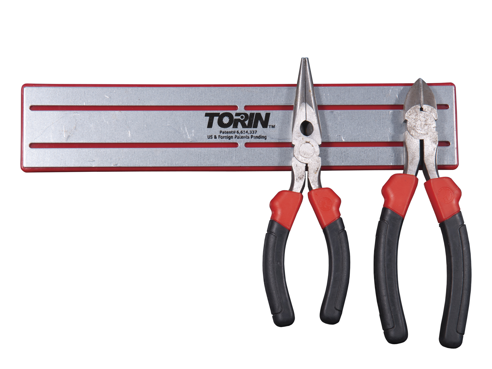
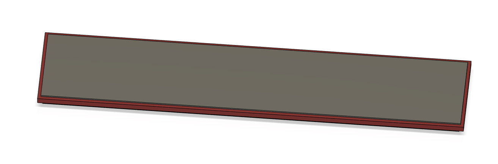
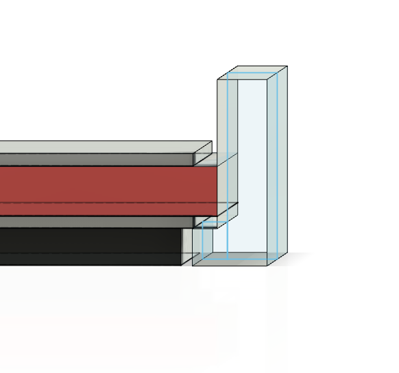
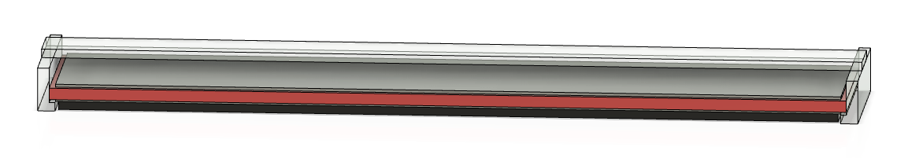
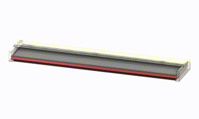
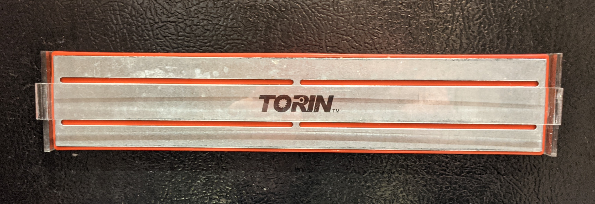
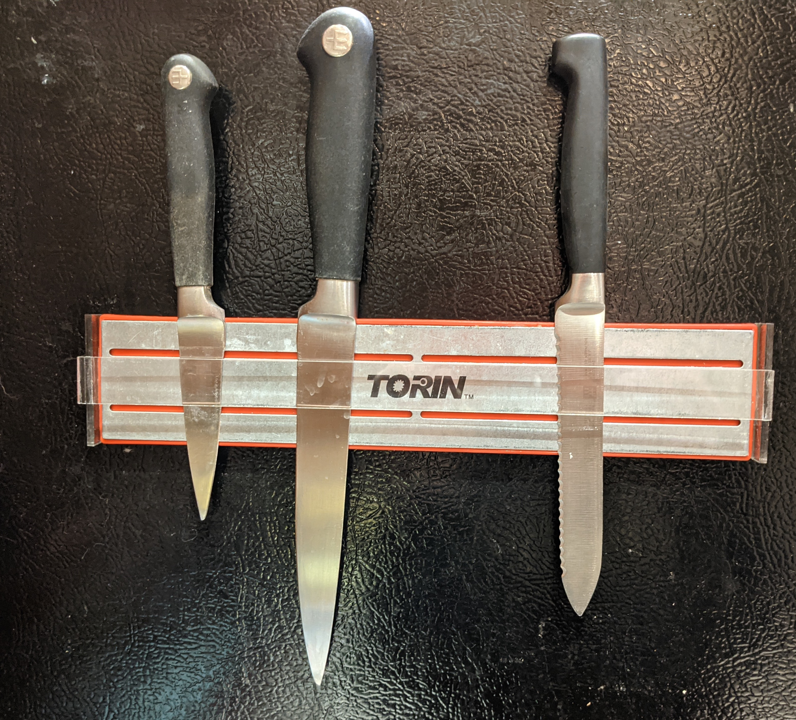

## Introduction

One of the things that you learn through your journey of building things is what makes sense to laser cut and what makes sense to 3D print.  Importantly, what your final process is going to be heavily impacts your design decisions.  One thing that impacts that is realizing that you can "weld" acrylic.  Much like PVC, the "glues" for acrylic are actually solvents that dissolve the material and allow it to solidify.  This means that if you get the dimensions correct that you can turn 2D laser cut items into solid 3D solutions.

## Problem

For a long time we've had this magnetic tool holder that we use to hold our sharp kitchen knives.  You seem something like this pretty commonly in commercial kitchens or people doing photo shoots of their houses showing how much they are "real chefs".  Of course, I think I got ours at [Lowe's](https://www.lowes.com/).

It holds the knives really well, except for our chef knife.  It is just the right combination of narrow and long that it works great 95% of the time.  Which means about 1 in 20 times, if you're not paying attention, it can fall. 

## Solution

I designed a series of simple acrylic pieces that can act as a "guard" to the magnet to keep the knives in place while being simple.

This is the first time I really spent some time modeling out what my target design would look like.  Normally I would just take measurements and then design from there, but there were a lot of very small tolerances I wanted to make sure I knew well.  Also, it was a good excuse to learn about materials in Fusion.  So, here is what the bare magnet looks like in my model.

In particular, I wanted to make sure that the end was going to work.  I needed to make sure:

* The acrylic wouldn't pull the back magnet away so it would hold well
* I had room for adhesive to the holder (I was planning to, and actually did, use hot glue there)
* Enough clearance for the knives

You can see some of the complexity if we zoom in on the end assembly.

Here is what the final design looks like.

I even got fancy and animated it in Fusion.  You can either view the [silky smooth mp4](assets/knife-holder-bare-acrylic.mp4), or just checkout the gif I made by using ffpmeg piped into gifsicle to create a mildly annoying version.

## Final product

Here is what it looks like in the real world.  I apologize in advance for having one of the knives facing the other way.  I think I did that just to be annoying, and now I realize the person most annoyed by it is me.

## Lessons learned

* If I were to do this over again I'd actually notch the sides to accept the top piece.  I put too much faith in the solvent.  It works good, but it has come apart once.  I forgot the lesson of "always make sure you have a mechanical connection" to make it stronger.  Not much harder and would work better.  
* Also, the cross-bar is about 2 mm too long, so I'd shorten that down by about, oh I don't know, 2 mm. 
