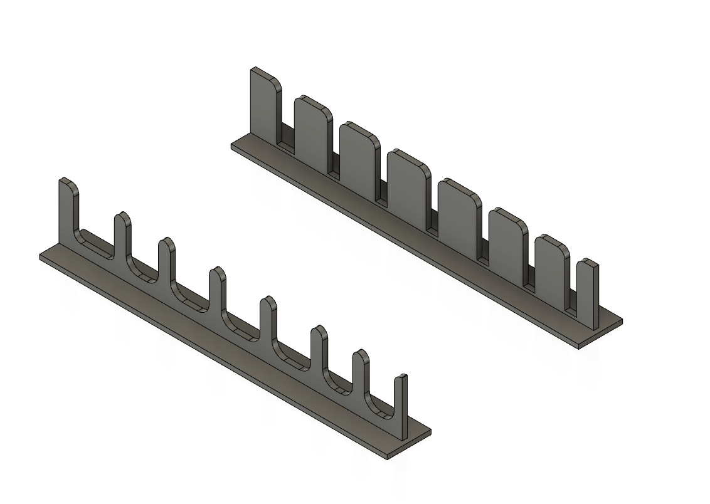
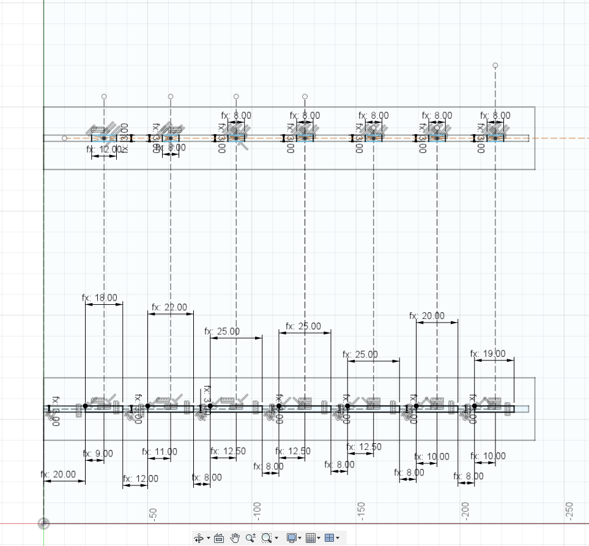
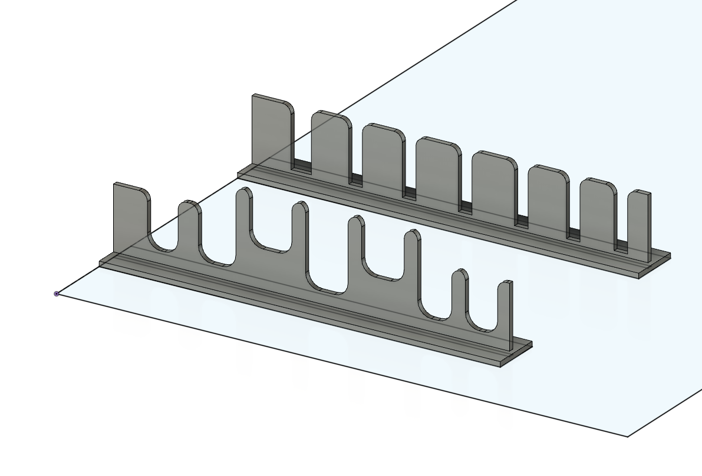
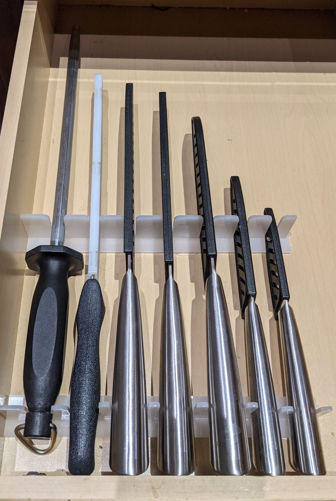

## Introduction
My wife bought some Schmidt Brothers knives from Costco to supplement/replace our three Wustof knives from the last 20 years. But she didn't want them taking up space on the counter, so just wanted them in a drawer.  That's great, except it turns into a disorganized mess.  So, she asked me to design a solution, and this is it.

:::note
On a related note we had been using a magnetic knife strip for the three Wustof knives and [I designed a different improvement for that.](knife-holder.md)
:::

## Design

Once again, I designed this in Fusion 360.  In this case I knew I was going to be doing two dimensional designs, but I also knew I wanted to align the blade slots with the handle slots.  The drawer needed to be able to hold 7 total items:

* 5 Schmidt Brothers knives
* Sharpening steel
* Bread knife

I had a few sheets of 3 mm frosted acrylic that I don't tend to use a lot, so it made sense to make it out of that.  I like acrylic for these applications because I can "weld" it, it's flat (so easier to cut on the laser) and weight isn't an issue.  Since I already know my material dimensions that simplifies design as well.

:::note
Now, because I have a 3D object in Fusion, I *could* 3D print these.  This is where understanding your manufacturing goals is helpful.  These would take hours to print and even at high infill would probably be brittle in the way the forces would act on them.  So, I'd have to make the design more robust to handle that, which would complicate the design and increase the print time.  So, lasercut 2D it is.
:::

## First version

I grab the drawer from the kitchen, all of the knives and head on down to [Heatsync](https://www.heatsynclabs.org) to cut and assemble.

I'm pretty happy with this first version.  It assembles well, aligns well, and I go ahead and hot glue it into the drawer, so it is reasonably easy to remove if I need to.

### Real world feedback

I get it home and reinstall it and there are ooh's and ahhs.  Everyone is suitably impressed.  I can already imagine my call from the Nobel prize committee.

But then that jerk Newton raises his hand.  In particular he asks me if I could please figure out how to count to *one* which is the number of the law he has that is a problem.  In particular:

> An object in motion, stays in motion

This applies because when you close the drawer, the drawer and all of its contents are moving.  Right until they're not.  The drawer has no choice but to stop because it's acted on by the counter, but the knives, they're like "Oh yeah, just keep on yeetin' me to the back of that drawer!"

This is not widely viewed as good behavior.  My suggestion that people should learn to close the drawer softer is not met with kindness and good cheer.

## Second version

There is one lone knife that resists Newton, and that's because the knife handle slot is slightly narrower than the end, so when it tries to lemming out, the knife handle slot holds it in place.  Given that, the only thing I need to do is to ensure I have better tolerances on the actual knife handle widths.

Here is what that looks like:

I also take this opportunity to customize the depth of a couple of the cutouts to deal with the fact that the handles are higher on the [Santoku style](https://www.cooksillustrated.com/articles/504-should-you-buy-a-santoku) knives.

So now the organizers look more like:

Once again this gets cut and installed, and now seems to work really well.  It does require better adhesion (a.k.a. more hot glue) but it has held up remarkably well and keeps the knives in their spaces.  I also need to be a little be better at the acrylic solvent and ensuring I have good connectivity there.

But finally, here it is "in situ".

