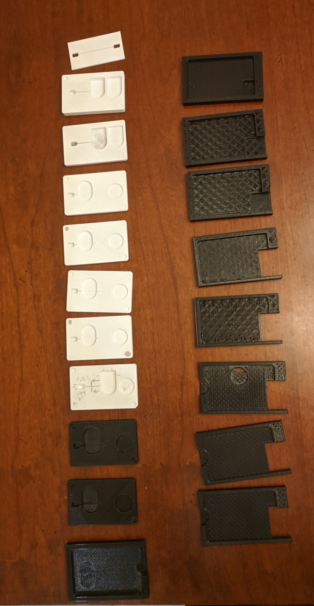
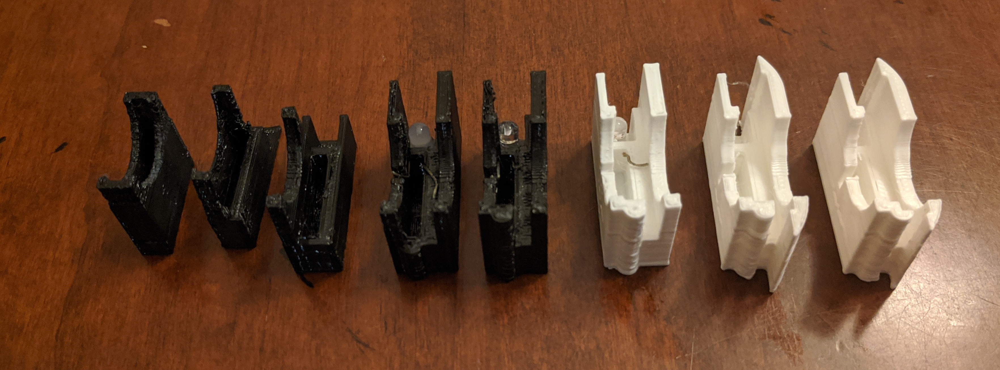
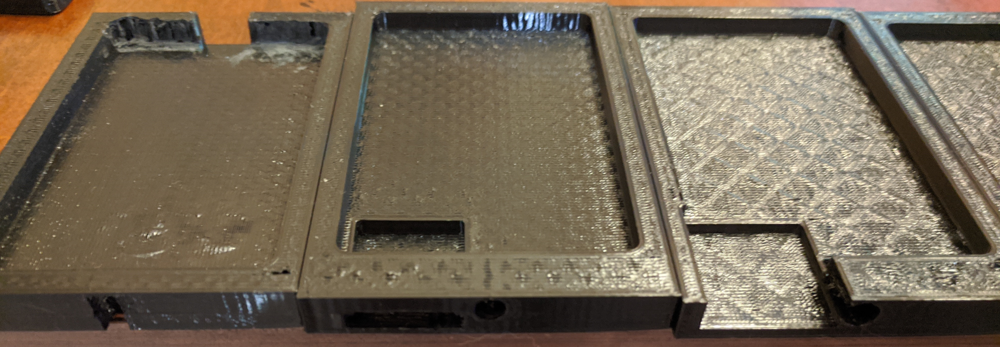
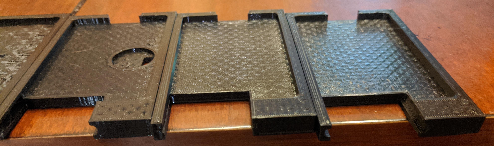
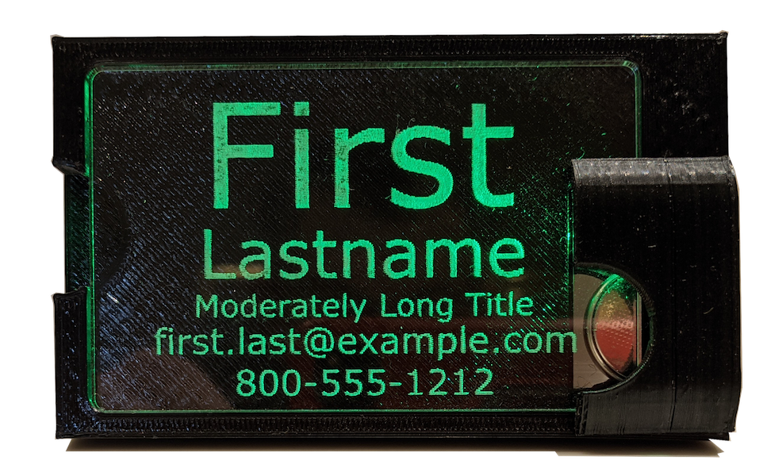
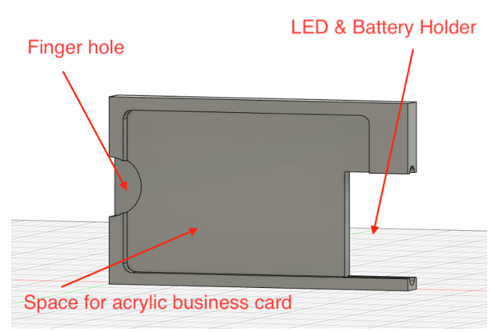
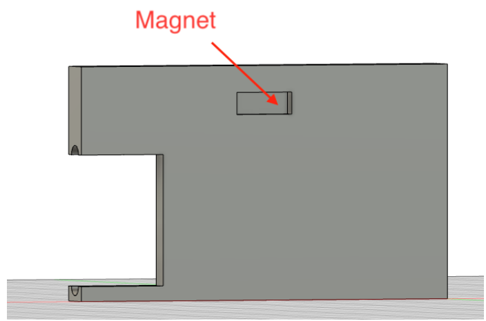
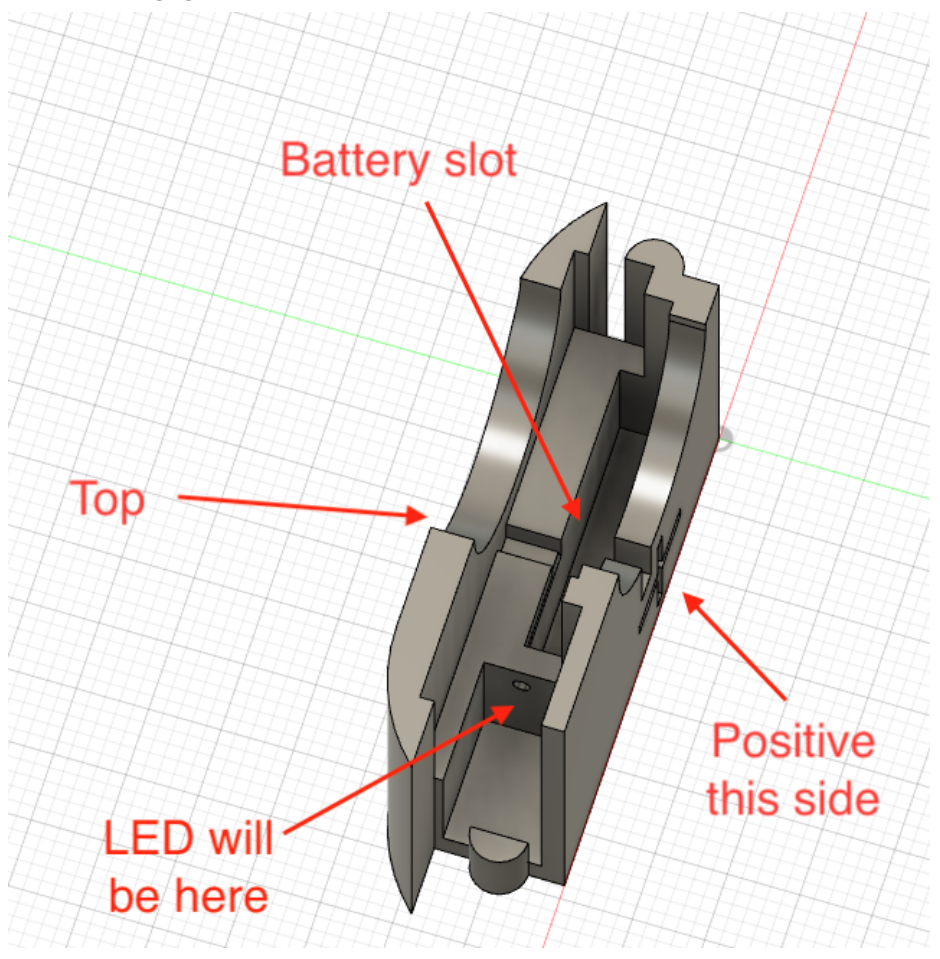

This is probably my longest running, hobby project, and maybe with the most potential to be something I can actually sell on [Etsy](https://www.etsy.com).  So, let's go on a journey.

## History

### Circa 2015
This all started when [Greg](https://www.ohack.org) bought a bunch of [these modules](https://www.adafruit.com/product/1621) from [Adafruit](https://www.adafruit.com).  At some point we discussed using them as name badges.  I designed a frame and battery holder.  

Finicky to assmble and felt very difficult to customize. it was nonetheless fun, useful and had positive reviews.  At this stage I was just using [SketchUp](https://www.sketchup.com/) for all of my designs.

### Circa 2018

Fast forward, and I've started to think more about doing them as engraved acrylic.  My goal at this point is to make something I can engrave and the light up with bare LEDs.  I'm still using SketchUp at this point, but have settled into a few design decisions that still stand today.

1. Form factor for the badge portion is credit card sized.  It's an establish form factor that people are comfortable with.
2. Bare LEDs
3. Battery is a CR2032.

There are few things in this design that don't survive:

1.  Using magnets to hold the acrylic to the backplate.  It requires etching the acrylic for them and just doesn't work well.
2.  Battery storage when not in use.  Complicates things and makes the final product look worse.
3.  Having the LED behind the acrylic.

This last one is the deal killer for this design.  I tried etching/painting and then engraving, I tried all sorts of things, but in the end, the result just looked terrible.  The badge didn't really light up and you just saw the LED for the most part.

### Circa 2019-2020

I make the frustrating, but constructive change to [Fusion 360](https://www.autodesk.com/products/fusion-360/overview).  It's free for personal use, but has a pretty steep learning curve.  I watch Youtube videos, but I also get to cheat, as my teenage son has a ton of experience with 3D modeling in the various tools, so I can just bellow at him from across the house when I'm stuck on something I think should be easy.  

Also, you might have heard of this *Covid* thing.  That has two impacts.  

1. Suddenly, I was spending a lot more time at home.
2. Through [Heatsync](https://www.heatsynclabs.org) I got involved in 3D printing [PPE](https://www.osha.gov/personal-protective-equipment) for (Masks for Docs)[https://masksfordocs.com/].  
This suddenly meant that I had to really learn how to use a 3D printer.  I ended up running two Creality CR-10's (one from our neighbor) close to 24x7 for several months.  This meant I because intimately familiar with all the foibles there, and also got comfortable with slicers.

Rapid prototyping accelerates and you can see the evolution kick into gear.  I took a photo of all of my prototypes from start to finish, just before I threw them all out, because no one needs to hold on to that much stuff.

While the badge itself clearly evolved, it also turned into a two piece system.  One for the badge, and one for the battery/LED.

Starting simple, it became more complex as I had to work through the various tradeoffs to get a good solution.

Once I had two pieces, the interface between them became equally important.

## (Mostly) Finished Product

I'm pretty happy with this overall.  Maybe there are better ways to do a few things, but I feel this is pretty good.

Examples:
* You can see the battery.  This is necessary so that you have the finger holes so that you can take it in and out.
* The battery holder covers part of the badge.  
  * It's necessary to get the LED centered on the edge of the badge, and you want to prevent the viewers from seeing that.  
  * The battery has a minimum size, so that impacts it as well.
  * It secures the badge from falling out.  It is actually pressure fit pretty well, but this 
helps a lot.
* I use reflective tape on the left edge of the acrylic to help brighten it up.

### Front
	

### Back
	

This actually complicates the 3D print a bit, because it prints without supports, because I avoid them when I can. But, I think it helps to align everything and I like it as shirt "pin".  

### Battery holder

As everyone knows, the last part of any 3D design is to "chamfer all the things!"  It really did help.  

### Final Pieces
At this point, it's mostly complete.  

* I can 3D print all the pieces I need.  
* I can cut and engrave the acrylic reliably.
* I've designed a [Shipping box](shipping-box.md) for it.
* I've even created a rudimentary (and sarcastic) [User Guide](https://docs.google.com/document/d/1iJHpS938YActAiaLbJMJxlZzPNfw25qkCCf06TzlLQA/edit?usp=sharing)

All that's left is for me to decide if I really want to try to sell them.
