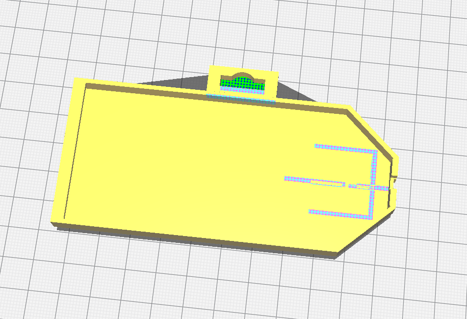
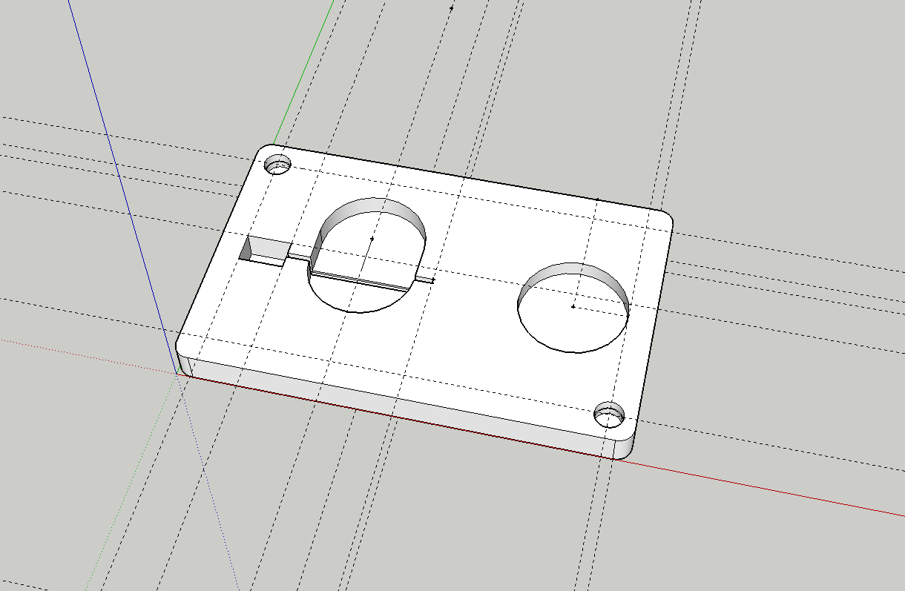

This is probably my longest running, hobby project, and maybe with the most potential to be something I can actually sell on [Etsy](https://www.etsy.com).  So, let's go on a journey.

## History

### Circa 2015
This all started when [Greg](https://www.ohack.org) bought a bunch of [these modules](https://www.adafruit.com/product/1621) from [Adafruit](https://www.adafruit.com).  At some point we discussed using them as name badges.  I designed a frame and battery holder.  

Finicky to assmble and felt very difficult to customize. it was nonetheless fun, useful and had positive reviews.  At this stage I was just using [SketchUp](https://www.sketchup.com/) for all of my designs.

### Circa 2018

Fast forward, and I've started to think more about doing them as engraved acrylic.  My goal at this point is to make something I can engrave and the light up with bare LEDs.  I'm still using SketchUp at this point, but have settled into a few design decisions that still stand today.

1. Form factor for the badge portion is credit card sized.  It's an establish form factor that people are comfortable with.
2. Bare LEDs
3. Battery is a CR2032.

There are few things in this design that don't survive:

1.  Using magnets to hold the acrylic to the backplate.  It requires etching the acrylic for them and just doesn't work well.
2.  Battery storage when not in use.  Complicates things and makes the final product look worse.
3.  Having the LED behind the acrylic.

This last one is the deal killer for this design.  I tried etching/painting and then engraving, I tried all sorts of things, but in the end, the result just looked terrible.  The badge didn't really light up and you just saw the LED for the most part.

### Circa 2019-2020

I make the frustrating, but constructive change to [Fusion 360](https://www.autodesk.com/products/fusion-360/overview).  It's free for personal use, but has a pretty steep learning curve.  I watch Youtube videos, but I also get to cheat, as my teenage son has a ton of experience with 3D modeling in the various tools, so I can just bellow at him from across the house when I'm stuck on something I think should be easy
