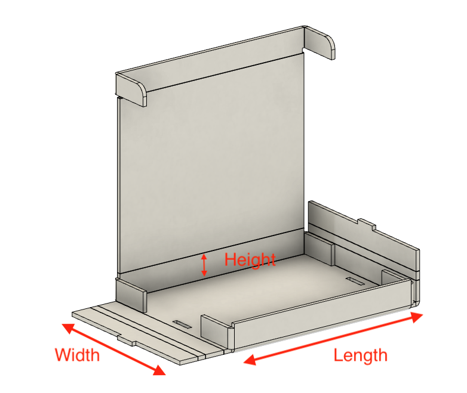

I decided I wanted to be able to have a "pizza box" style shipping box.  Ideally, I wanted to be able to up-cycle cardboard I had in order to create these.  This cardboard was primarly sourced from boxes already delivered to me that I would just recycle.  

> *This is the box with my [Light Up Name Badge](name-badge.md) packaged up in it.  The next thing I need to document.*

## Design
Now, best case scenario a pattern already existed and I could just use that, but I really searched and couldn't find it.  So, here are my design goals:

1.  It needs to be parametric, which is to say, I can just change the inner dimensions for whatever I want to ship and the box changes.
2.  I need to be able to laser cut it.
3.  It needs to be adaptable to different material thicknesses, because I don't know what kind of boxes I'll have.

As usual, I started in Fusion360.  A quick google will reveal to you that the sheet metal tools in Fusion are perfect for this.  It allows you to take a material and bend it around, and the fact that it's not metal but cardboard doesn't matter.

The challenge is that there are points in a pizza box where you need the bend to go around a non-adjacent face (I'll try to explain later).  In that case you actually need to add some material so that's an option.  The net result is if the material you're using changes thickness, you need to change it two places.

## Result
Here is the box in Fusion.

I've also unfolded it a bit more and added dimensions so you know what *I'm* talking about when I say width and length.  These dimensions are the *inner* dimensions, so sized for the object you want it to hold.

## Resizing the box
If you're just looking to change the dimensions and the materials, here is how you do it.  First change it in the parametric section.

Then you need to change *only the material thickness* in the sheet metal materials section as well.

  

## Export as DXF

### Correct the DXF

## Crease and fold

## Files

* [Fusion file](assets/shipping-box.f3d)
* [Step file](assets/shipping-box.step)
