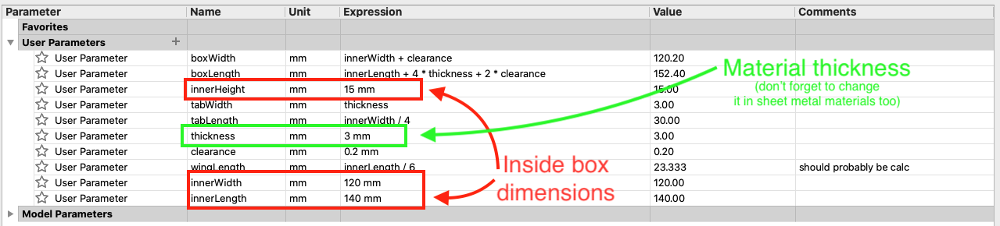
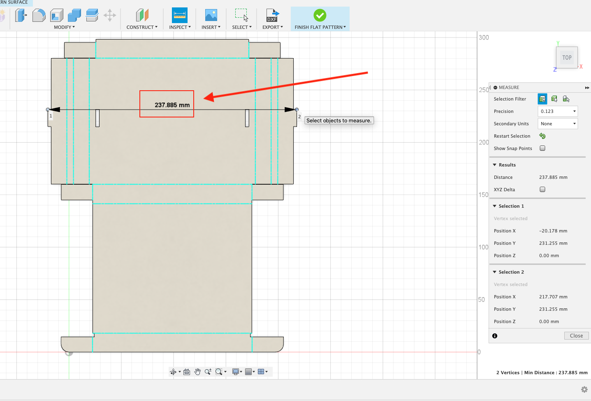
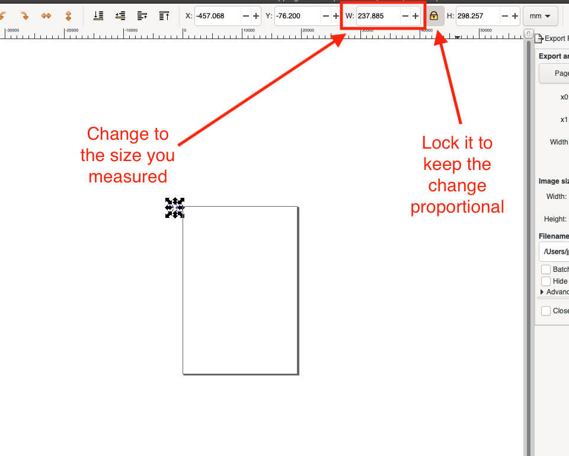

I decided I wanted to be able to have a "pizza box" style shipping box.  Ideally, I wanted to be able to up-cycle cardboard I had in order to create these.  This cardboard was primarly sourced from boxes already delivered to me that I would just recycle.  

> *This is the box with my [Light Up Name Badge](name-badge.md) packaged up in it.  The next thing I need to document.*

## Design
Now, best case scenario a pattern already existed and I could just use that, but I really searched and couldn't find it.  So, here are my design goals:

1.  It needs to be parametric, which is to say, I can just change the inner dimensions for whatever I want to ship and the box changes.
2.  I need to be able to laser cut it.
3.  It needs to be adaptable to different material thicknesses, because I don't know what kind of boxes I'll have.

As usual, I started in Fusion360.  A quick google will reveal to you that the sheet metal tools in Fusion are perfect for this.  It allows you to take a material and bend it around, and the fact that it's not metal but cardboard doesn't matter.

The challenge is that there are points in a pizza box where you need the bend to go around a non-adjacent face (I'll try to explain later).  In that case you actually need to add some material so that's an option.  The net result is if the material you're using changes thickness, you need to change it two places.

## Result
Here is the box in Fusion.

I've also unfolded it a bit more and added dimensions so you know what *I'm* talking about when I say width and length.  These dimensions are the *inner* dimensions, so sized for the object you want it to hold.

## Resizing the box
If you're just looking to change the dimensions and the materials, here is how you do it.  First change it in the parametric section.

Then you need to change *only the material thickness* in the sheet metal materials section as well.

  

## Create the flat pattern

You need to turn it into a single plane.

## Export as DXF

### Correct the DXF

Now, for reasons I don't understand, sometimes the dimensions of the dxf are wildly different from what they end up in Inkscape.

* First thing I do is "Select All" (command/control A).
* Then hit "4" to zoom to selection.  It will probably look completely unlike what your flat pattern looked like.
* Go to View -> Display -> Outline Mode ... now things should look reasoable
* Use the rectangular selection to grab it all
* Shift-Control-R to resize the canvas to your selection
* "4" again to get it full in view

That now gets you to a good baseline

Generally I like to make sure I measure (Inspect) one of the widest dimensions.

Even though I set the defaults to mm, seems like I end up in px too often.  Switch over and see what I have.

Resize it to a reasonable number.  See how ridiculous that looks?  This is where you do the "shift-control-r" trick followed by a "4" to make it look reasonable again.

For some reason the DXF always ends up with three lines on the fold instead of one.  Probably due to the way sheet metal works.  Here is an example.  You'll really have to zoom in.

So, clean those all up.  Generally you want to remove the outside lines, but in the end it doesn't matter that much.

You can now setup your palette to cut the lines that need to be cut and to simply lightly score the guidelines for folding.

## Crease and fold
Now comes the crux of the problem.  I haven't figured out a good way to get the cardboard to crease so I can make the boxes really nice.  I suspect at an industrial scale they have a press that does it and bends everything, but I don't.

I have used a sheet metal break, and it's a bit slow, but does make good creases.  Even with that, the box doesn't want to completely fold and I have to use hot-glue to hold in the tabs.

## Files

I'm providing the files here so you don't have to try to recreate it.  However, my requirement is that if you decide to host them somewhere else you are required to provide attribution per the [attribution requirements](attribution).

* [Fusion file](assets/shipping-box.f3d)
* [Step file](assets/shipping-box.step)
