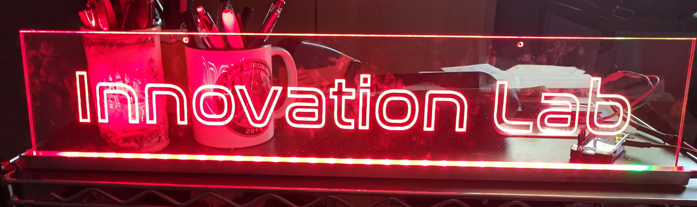
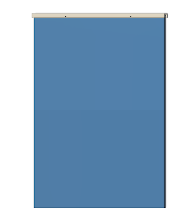
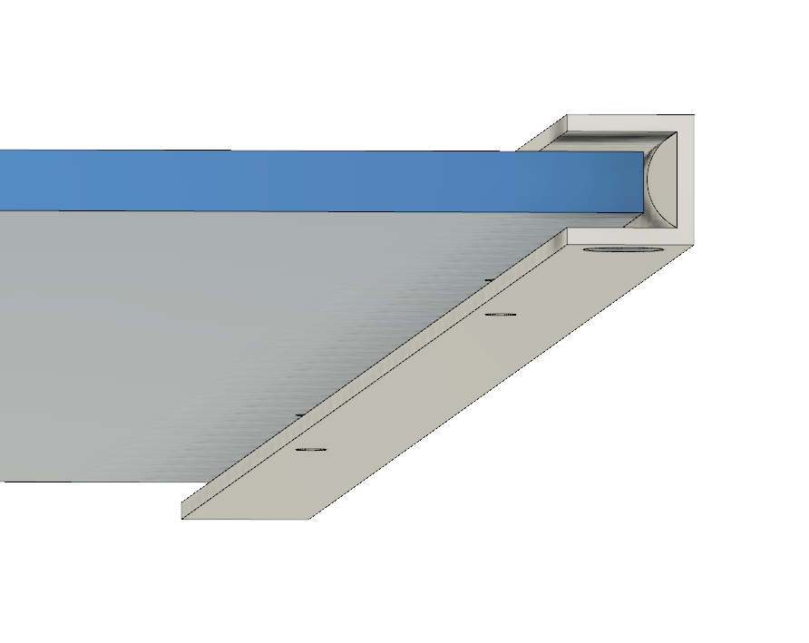

*(Don't worry, this isn't the finished sign)*

## Introduction
At our office back in the times where we did crazy things, like go to the office, we had our "Innovation Lab".  This was an former conference room turned into a general purpose room where we would get together to brainstorm, talk and occassionally get patents.  I think about 50% of the people came for the free pizza, which was certainly one of my prime motivations.

The sign outside the lab though was pathetic.  So, I put together a proposal to build a suitable sign.  I'd gotten pretty comfortable with engraving acrylic, and had an idea, so off I went.

## Design
First I needed to get the artwork.  This was reasonably easy because the company already had it, so getting it as SVG took a few emails, but nothing outrages.  I knew I wanted something edge lit, and spent some time thinking about it and estimating sizes.  In the end I decided I wanted something that looked suspended and clean. 

### LEDs
The intial design tradeoffs were about the width of the acrylic versus the availability of aluminum channel to hold it and the width of the LEDs.  I knew I wanted indvidually addressable RGB so that I can do as many cool patterns as possible.  We had used [these Alitove WS2812B](https://smile.amazon.com/gp/product/B07FVR6W71/ref=ppx_yo_dt_b_search_asin_title?ie=UTF8&psc=1) for the Infinity Snare Drum (yes, I should write that up), so I had some familiarity with them.

### Controller
Now, I could have done this with an Arduino, but I knew I could potentially want web control and a bunch of other things, so I decided to go with a [Raspberry Pi Zero W](https://www.adafruit.com/product/3410).  This would also likely force me to spend more time in python, which is a good thing.  In hindsight I would have gotten the one that had the header already soldered on, because describing my soldering skills and *questionable* is generous.  But, I got it done.

### Acrylic
I've had really good luck with the cast acrylic I get from [Port Plastics](https://portplastics.com), so I ordered two sheets from there.

### Aluminum channel
I started off by looking at Lowe's and Home Depot for what they had available.  My hope is to use all of these same supplies for other related signs for the lab as well, so overbuying a little bit isn't a challenge.  The channel they had that fit the best was 10mm x 10mm inner dimensions.  That worked for width, but was extremely tight for height, but I thought I could get it to work.

This close up of the channel shows you some of the complexity.

You need the screws to be low enough to be able to hang the acrylic, but not so low that you don't have enough aluminum to support it, or the acrylic holes are too fragile.

The half circle you see there represents the profile of LED strip.  In the end, it should all *just barely* work, and I don't have that kind of precision.   So, I went to [AZ Metals](https://www.az-metals.net/) to see what they had, and they had 20mm x 20mm channel for the same cost as the smaller channel.

## Creation

### Acrylic
* Design
* Acrylic cutting/engraving

### Pi

* auto wifi
* python

